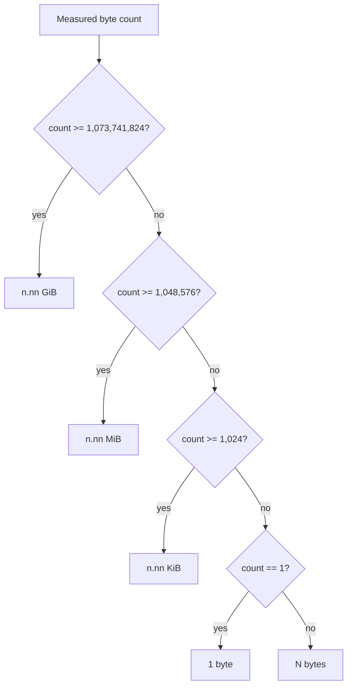

# IEC binary file-size display

## Buyer-visible decision

After a reference-video download or a cache hit, `download-reference.sh` reports
the on-disk size in compact units. The command measures bytes with POSIX `wc -c`
resolved from `/usr/bin/wc` or `/bin/wc` (never from `PATH`) and then selects
the largest IEC 80000-13 binary prefix that the count reaches:

- `1 byte` or `N bytes` below 1024 bytes;
- `n.nn KiB` from 1024 bytes;
- `n.nn MiB` from 1,048,576 bytes; and
- `n.nn GiB` from 1,073,741,824 bytes.

The labels match the 1024-based divisors. A 2,097,152-byte artifact is
`2.00 MiB`. It is not `2.00 MB`. SI megabyte conventionally means 1,000,000
bytes, so reusing `MB` for a 1,048,576-byte divisor makes a finished download
look 4.86% larger than the SI reading.

Use this line to confirm the local file is a real video rather than a stub
before you spend the next prompt-generation step on it. If the size is a few
bytes, delete the path and download again.

## Why cache hits print the same size

The output path is a caller-owned cache key. Repeating the command skips
`yt-dlp`, but the buyer still needs to know whether the preserved file is a
multi-megabyte video or a leftover placeholder. The cache-hit branch therefore
prints the same `Size:` line without opening a network connection.

Size display does not change cache authority: `-f` and `-s` still decide the
hit, the existing bytes stay untouched, and the path still passes through
`terminal_print_value`.

## Rounding and portability

Two-decimal rounding uses Bash integer arithmetic:

`rounded_hundredths = (byte_count * 100 + divisor / 2) / divisor`

This matches `printf %.2f` rounding for the tested boundaries and avoids an
`awk` dependency on the cache-hit PATH, which must not contain `yt-dlp`, `brew`,
`pip`, or `wc`. A PATH lookup of `wc` turns a successful skip into exit 127
when the caller supplies a stripped PATH. The formatter rejects a non-numeric
count instead of letting `[ -ge ]` abort with an opaque comparison error.

If neither `/usr/bin/wc` nor `/bin/wc` is executable, the command still skips
the download and preserves the artifact. It omits the `Size:` line rather than
failing the cache hit.

GNU `numfmt --to=iec-i` is not used. It is not part of POSIX and is absent on
common macOS developer machines.

## Test-first evidence

The CLI suite now checks real artifacts, not string fixtures:

- the existing 26-byte cache-hit payload must print `Size: 26 bytes` while
  `PATH` contains only `dirname` (`command -v wc` fails);
- 1-byte, 512-byte, 1024-byte, 1536-byte, and 1,048,576-byte cache hits must
  print `1 byte`, `512 bytes`, `1.00 KiB`, `1.50 KiB`, and `1.00 MiB`;
- a mocked `yt-dlp` that writes exactly 2,048 KiB must print `Size: 2.00 MiB`
  and must not print `Size: 2.00 MB`;
- a static scan forbids `$(wc -c` PATH lookups; and
- a static scan forbids `printf` formats that attach `KB`, `MB`, or `GB` to a
  1024-based conversion.

The human-readable download fixture reuses the suite `TMP_DIR` and its `EXIT`
trap. A second `mktemp` plus a replacement `trap` would leak the argument-
separator directory on failure.

## Rollback

If product copy must use SI labels, change the formatter, the static scan, and
this record together. Do not keep 1024-based math under `KB`/`MB`/`GB`. If size
display is removed, delete the cache-hit and download assertions with it.

## References

International Electrotechnical Commission. (2025). *Quantities and units—Part
13: Information science and technology* (IEC 80000-13:2025).
https://www.iso.org/standard/87648.html

International Electrotechnical Commission. (2008). *Quantities and units—Part
13: Information science and technology* (IEC 80000-13:2008).

IEEE. (2021). *IEEE standard for prefixes for binary multiples* (IEEE Std
1541-2021). https://doi.org/10.1109/IEEESTD.2021.9321803

Thompson, A., & Taylor, B. N. (2008). *Guide for the use of the International
System of Units (SI)* (NIST Special Publication 811, 2008 ed.). National
Institute of Standards and Technology. https://doi.org/10.6028/NIST.SP.811e2008

National Institute of Standards and Technology. (n.d.). *Definitions of the SI
units: The binary prefixes*.
https://physics.nist.gov/cuu/Units/binary.html

The Open Group. (2024). *wc*. In *POSIX.1-2024*.
https://pubs.opengroup.org/onlinepubs/9799919799/utilities/wc.html

These references are used as engineering guidance. This project does not claim
formal IEC, IEEE, NIST, or POSIX certification.
